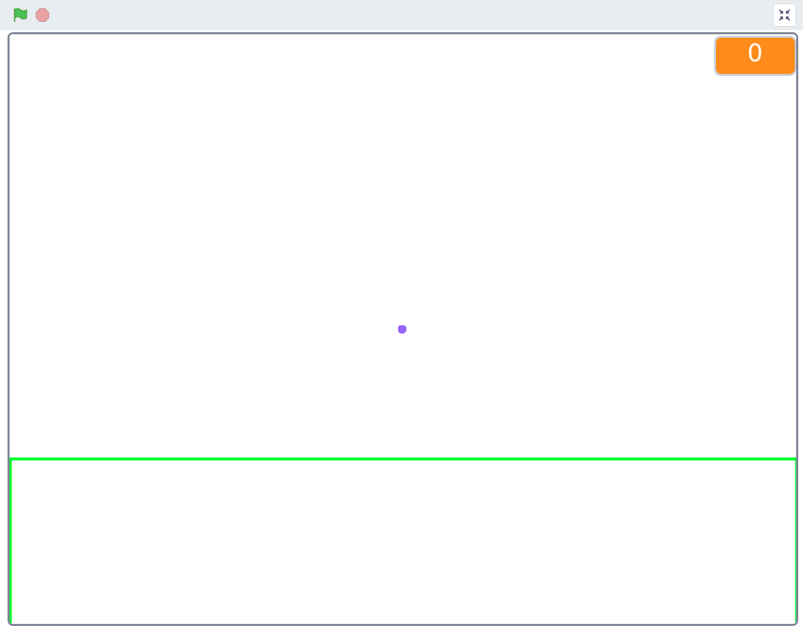
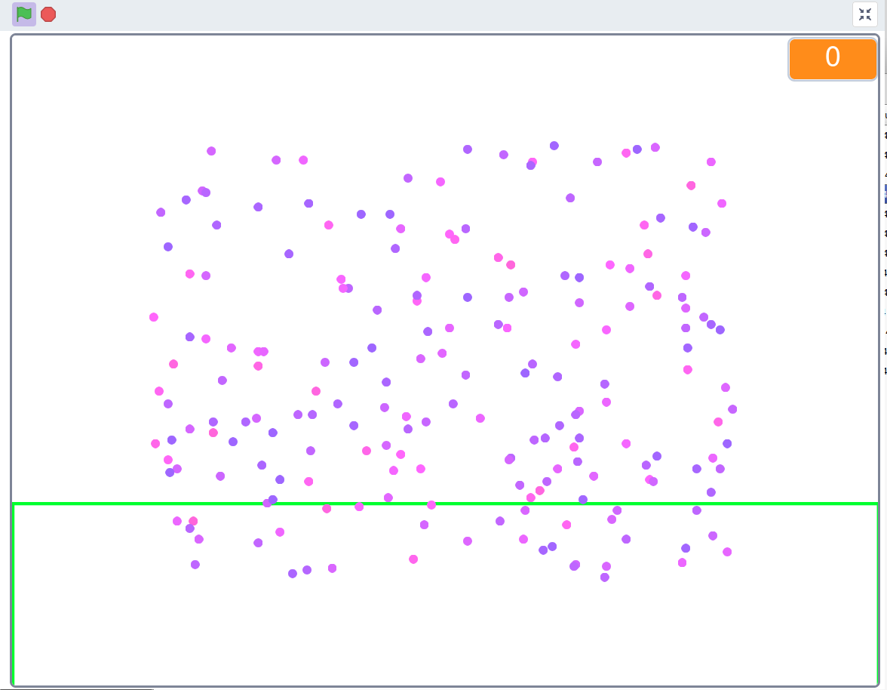

# Evolution

I got this idea from Pascal Corpsman and his biosim4. I thought the program was so great that I tried to recreate it in scratch.

In this program you can watch points trying to get into a marked area and if they succeed they stay there, if not they try again.

## Key assignment

| Key | description |
| --- | --- | 
| 🔼️ | field up
| 🔽️ | field down
| ▶️ | field right
| ◀️ | field left

To start thr program you have to pres the green flag and then one of the keys thet i descriptet on top.
