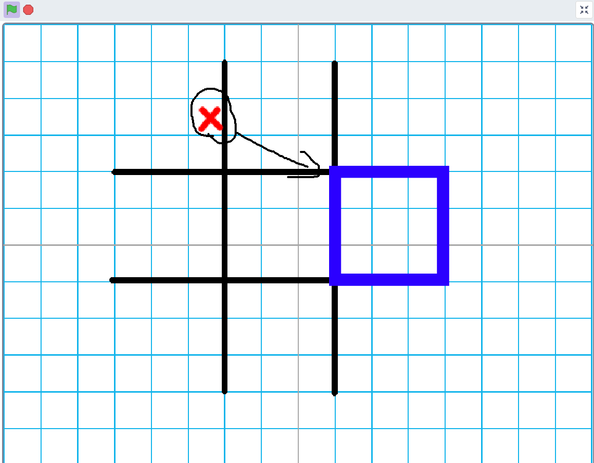
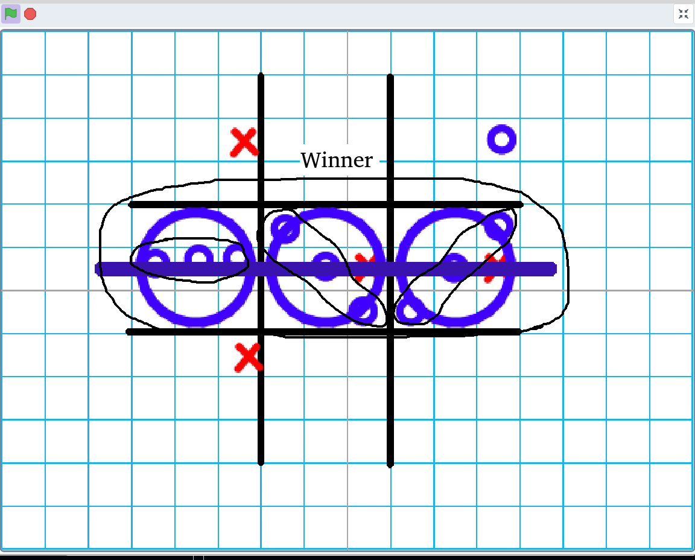

# Killer Tic Tac To

Start everiwehr.

You havt to make your cross or cirkle everiwehr in the korekt big field.

If there is a winner in a field, the field belongs to the person who won it and the first person to have three large fields in a row wins. For example, if the lower left field has been won and then someone places a cross or circle in a small field that is in a lower left field, then the next person is free to decide where to place it

| Key | description |
| --- | --- |
| x | cross
| o | cirkle
