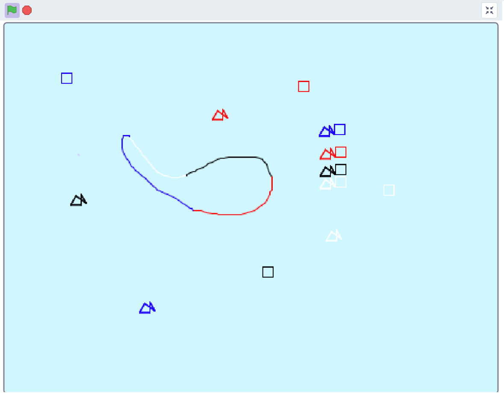

# paint

In this program you can paint with 4 different colors.

## Key assignment

| Key | description |
| --- | --- |
| h+number | change baground
| mose left klick| draw
| b | color blue
| r | color red
| s/b | color black
| w | color white
| f | fish
| v/s | square

!! Attention !!
To change the baground you need to use the right numbers of the keyboard not the ones above the letters.
