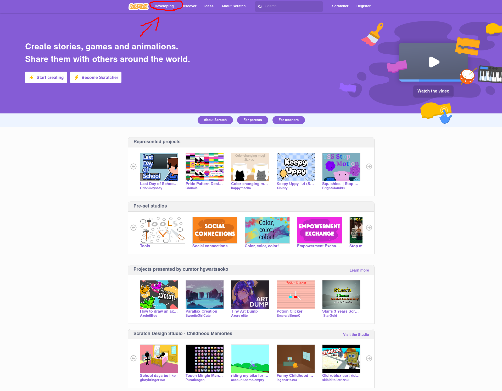
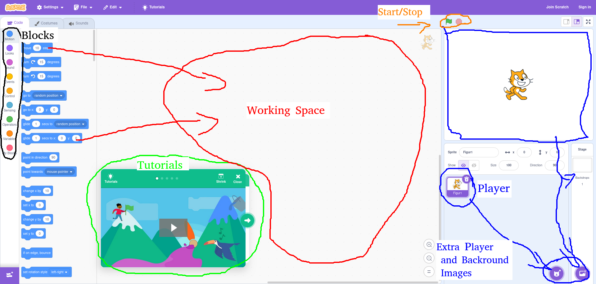

# How To Start Scratch

https://scratch.mit.edu

Klick on development then you can do another page.

Here you can see the different things that you can do on this page.
I hope that this is helpfull and now you can make you own programs.😀️
